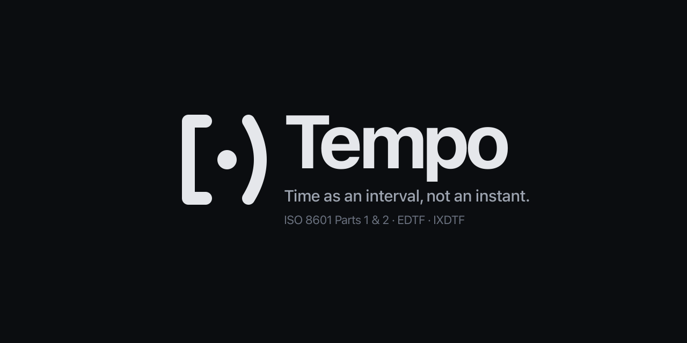

# Tempo

**Time as an interval, not an instant.**



Tempo is an Elixir library that models time the way humans actually use it — as bounded spans on a shared timeline rather than as scalar instants. One type represents every temporal value you might deal with: a year, a month, an afternoon, a meeting, an archaeological period, a recurring event, a free-busy calendar. Every value is a bounded interval at some resolution, and every operation (iteration, comparison, set-theoretic combination) is defined uniformly.

This conceptual shift — *time as interval, not instant* — removes a surprising number of real-world bugs (off-by-one day errors, ambiguous "end of day", last day of month, last day of year, DST edge cases, "what date does this year mean?") while unlocking queries that are awkward or impossible in other libraries.

## Why intervals, not instants

Every mainstream language treats `date`, `time`, and `datetime` as distinct scalar types. That fragmentation creates three classes of common bugs that Tempo eliminates by construction:

1. *The "what does this value mean" ambiguity:* Is `~D[2026-06-15]` the instant of midnight on June 15, or the whole day? Most libraries can't say — the type is a scalar but it's being *used* as a span, with every developer inventing their own `end_of_day/1` helper. In Tempo, `~o"2026-06-15"` *is* the interval `[2026-06-15T00:00, 2026-06-16T00:00)`. No helpers needed; the semantics are the type.

2. *The type-per-resolution explosion:* `Date` for days, `Time` for hours/minutes/seconds, `DateTime` for the combination — and conversions between them are lossy in confusing directions. Tempo's single `%Tempo{}` struct carries its own resolution. A year, a month, a meeting, a millennium — same type, different resolution.

3. *The "I can't express that" ceiling:* Archaeological dates ("sometime in the 1560s"), EDTF-qualified values ("approximately 2022"), open-ended intervals ("from 1985 onwards"), Hebrew-to-Gregorian queries, recurrences, free-busy spans — all awkward or impossible to express cleanly as scalar instants. All natural in Tempo.

Once every value is a bounded interval, set operations follow naturally: union, intersection, complement, difference, and predicates (`overlaps?`, `subset?`, `contains?`) all work on any combination of Tempo values, across resolutions, across timezones, across calendars.

## What it looks like

Full ISO 8601-2 / EDTF / IXDTF support, calendar-aware arithmetic, cross-zone set operations. In fact, probably the only fully ISO 8601 Parts 1 and 2 in existence (really, I couldn't find one anywhere - please let me know if you know of one).

```elixir
# A date is an interval
iex> ~o"2026-06-15"
~o"2026Y6M15D"

# Its bounds are real — Tempo.Interval construction, not a helper
iex> {:ok, %Tempo.Interval{from: from, to: to}} = Tempo.to_interval(~o"2026-06-15")
iex> {from.time, to.time}
{[year: 2026, month: 6, day: 15, hour: 0], [year: 2026, month: 6, day: 16, hour: 0]}

# Cross-zone set operations compare by UTC, preserve the first operand's zone
iex> paris = Tempo.from_elixir(DateTime.new!(~D[2026-06-15], ~T[10:00:00], "Europe/Paris"))
iex> utc_window = ~o"2026-06-15T07/2026-06-15T09"   # UTC 07:00..09:00
iex> Tempo.overlaps?(paris, utc_window)
true   # Paris 10:00 CEST == UTC 08:00 — inside the window

# Cross-calendar comparison, no manual conversion
iex> hebrew = Tempo.new!(year: 5786, month: 10, day: 30, calendar: Calendrical.Hebrew)
iex> Tempo.overlaps?(hebrew, ~o"2026-06-15")
true   # Hebrew 5786-10-30 is Gregorian 2026-06-15
```

### Three ways to construct a Tempo

The `~o` sigil is ideal for literal values in source code. For runtime data — form inputs, database rows, API payloads — reach for `Tempo.new/1`, which takes any order of keyword components and validates them against the target calendar:

```elixir
# Compile-time literal — the sigil
iex> ~o"2026-06-15T14:30[Australia/Sydney]"

# Runtime components — `new/1` reorders any input shape coarse-to-fine
iex> Tempo.new!(day: 15, year: 2026, month: 6, hour: 14, minute: 30, zone: "Australia/Sydney")

# Bridging stdlib — `from_elixir/1` accepts Date / Time / NaiveDateTime / DateTime
iex> Tempo.from_elixir(~U[2026-06-15 14:30:00Z])
```

`Tempo.new/1` validates components against the target calendar (Gregorian's February only has 28 days in non-leap years, Hebrew has a 13th month in leap years, etc.), returns `{:ok, tempo}` or `{:error, exception}`, and has a `new!/1` bang variant that raises on invalid input. `Tempo.Interval.new/1` and `Tempo.Duration.new/1` follow the same contract.

Now the playful side — what you actually get to write:

```elixir
# "Sometime in the 1560s"
iex> Enum.take(~o"156X", 5)
[~o"1560Y", ~o"1561Y", ~o"1562Y", ~o"1563Y", ~o"1564Y"]

# "The 15th of every month in 1985" — not one span, a real set of days
iex> {:ok, set} = Tempo.to_interval(~o"1985-XX-15")
iex> Tempo.IntervalSet.count(set)
12

# Free time, accounting for meetings in a real schedule
iex> {:ok, schedule} = Tempo.ICal.from_ical_file("~/work.ics")
iex> {:ok, free} = Tempo.difference(~o"2026-06-15T09/2026-06-15T17", schedule)
```

The inspect output carries metadata inline — iCalendar events show their summary and location on every interval that survives set operations:

```elixir
iex> ics = File.read!("~/work.ics")
iex> {:ok, schedule} = Tempo.ICal.from_ical(ics)
iex> schedule
#Tempo.IntervalSet<[
  #Tempo.Interval<~o"2026Y6M15DT10HZ/2026Y6M15DT11HZ" · Design review @ Room 101>,
  #Tempo.Interval<~o"2026Y6M16DT14HZ/2026Y6M16DT15HZ" · 1:1 with Ada>,
  #Tempo.Interval<~o"2026Y6M17DT09HZ/2026Y6M17DT09HZ30MZ" · Standup>
] · Work>
```

And when you're looking at an unfamiliar value in iex, ask it to explain itself:

```elixir
iex> Tempo.explain(~o"156X")
"""
A masked year spanning the 1560s.
Span: [1560-01-01, 1570-01-01).
Iterates at :month granularity.
Materialise as an interval with `Tempo.to_interval/1`.
"""

iex> Tempo.explain(~o"1984?/2004~")
"""
A closed interval.
From: 1984-01-01.
To:   2004-01-01 (exclusive — half-open `[from, to)`).
"""
```

`Tempo.Explain.explain/1` returns a structured form with semantic part tags (`:headline`, `:span`, `:qualification`, `:metadata`, …); `to_string/1`, `to_ansi/1`, and `to_iodata/1` format it for terminal, coloured terminal, and HTML/visualizer surfaces respectively.

## Objectives

* **A single type for every temporal value.** No more `Date` for days, `Time` for hours, `DateTime` for both, `NaiveDateTime` for "I don't know what I have." One `%Tempo{}` representing any interval at any resolution. Conversion from native Elixir types is `Tempo.from_elixir/2`.

* **Correctness by construction.** Every value is a bounded interval under the half-open `[from, to)` convention. Adjacent intervals concatenate cleanly (`[a, b) ++ [b, c) == [a, c)`). "End of day" ambiguity, midnight off-by-ones, and DST-hour confusion vanish at the type level.

* **Full support for the time standards that matter.** ISO 8601 Parts 1 and 2, EDTF Levels 0–2, IXDTF. 100% of the `unt-libraries/edtf-validate` corpus passes. Leap seconds, long years (`Y17E8`), significant-digits notation, mask syntax, open-ended intervals, per-endpoint qualifications — all parsed and queryable.

* **First-class set algebra on time.** Union, intersection, complement, difference, symmetric difference — plus the predicate set (`disjoint?`, `overlaps?`, `subset?`, `contains?`, `equal?`) — all defined over any Tempo value. Cross-zone, cross-calendar, across resolutions.

* **iCalendar import with metadata that travels.** `Tempo.ICal.from_ical/2` parses RFC 5545 `.ics` data and every event's metadata (summary, location, attendees, status, …) rides along through every downstream operation. Intersect your schedule with work hours, get back *which meetings* are in work hours.

* **Unlocking queries that used to be hard.** "Every Friday the 13th this century." "When was I both in Japan and enrolled at my university?" "Free time on Tuesday, accounting for meetings across three zones." "Does this dig layer overlap with this dynasty?" All direct expressions over the same `Tempo` API.

## Talks and background

The [ElixirConf '22 talk](https://www.youtube.com/watch?v=4VfPvCI901c) introduces the core idea of a unified time type and builds toward intervals as the primary representation. The talk is still a good overview of the thesis; the library has evolved substantially since — full ISO 8601-2 support, set operations, cross-calendar comparisons, iCalendar import, and recurring events have all landed in the years that followed.

## Prior art

Tempo draws on several bodies of work:

* **Allen's Interval Algebra** — James F. Allen's 13 relations between intervals (`precedes`, `meets`, `overlaps`, `finishes`, `contains`, `starts`, `equals`, and their inverses). [See the survey](https://ics.uci.edu/~alspaugh/cls/shr/allen.html). Tempo's interval relations and `overlaps?/2` / `contains?/2` predicates descend directly from this work.

* **Temporal databases and the chronon concept.** Jensen, Dyreson, and Tansel's *Consensus Glossary of Temporal Database Concepts* (1998) defines the *chronon* — an indivisible time unit whose resolution determines how the surrounding value is interpreted. Tempo's "resolution" field is the direct analogue.

* **Eric Evans' "Exploring Time"** talk. Evans makes the case for considering time as an interval rather than an instant in a domain-driven-design setting. His framing influenced the earliest design sketches of Tempo.

* **PostgreSQL multirange types.** Postgres 14+ ships sorted, non-overlapping, coalesced interval sets. Tempo's `%Tempo.IntervalSet{}` follows the same conceptual model; set operations follow the same sweep-line algorithms.

* **Wojtek Mach's [`calendar_interval`](https://github.com/wojtekmach/calendar_interval).** A partial-but-elegant implementation of calendar intervals in Elixir. Concepts from this library informed Tempo's implicit-span semantics.

* **ISO 8601-2 / EDTF.** The 2019 extension to ISO 8601 formalises archaeological and approximate dates. The `unt-libraries/edtf-validate` conformance corpus — the only public test suite for EDTF — is exercised in full.

* **RFC 5545 (iCalendar) / RFC 7529 (RSCALE).** The iCalendar specification for RRULE, RDATE, EXDATE, VTIMEZONE. Tempo imports `.ics` data via `Tempo.ICal.from_ical/2`.

* **IETF draft-ietf-sedate-datetime-extended (IXDTF).** The extended date-time format for annotations such as `[Europe/Paris][u-ca=hebrew]`. Supported in both parse and round-trip.

## Installation

```elixir
def deps do
  [
    {:ex_tempo, github: "kipcole9/tempo"},
    # Optional, only needed for iCalendar import:
    {:ical, "~> 2.0"}
  ]
end
```

A hex release is imminent. The package name is `ex_tempo` because the `tempo` name on hex was already taken; the library is imported as `use Tempo` / `alias Tempo` and feels like `tempo` in code. Docs at [https://hexdocs.pm/ex_tempo](https://hexdocs.pm/ex_tempo).

### Time-zone database

Any application that works with zoned datetimes needs a `Calendar.TimeZoneDatabase`. Tempo itself already depends on [`:tzdata`](https://hex.pm/packages/tzdata), and most Tempo APIs accept a zone database explicitly where one is needed — so you can use Tempo without any global configuration.

**iCalendar import is the exception**: the upstream `:ical` library only populates an event's `dtstart`/`dtend` fields when a default `Calendar.TimeZoneDatabase` is installed at the Elixir application level. If your `.ics` files use the `DTSTART;TZID=...` form (which most calendar tools produce), configure a database in your host application:

```elixir
# config/config.exs
config :elixir, :time_zone_database, Tzdata.TimeZoneDatabase
```

Either [`:tzdata`](https://hex.pm/packages/tzdata) or [`:tz`](https://hex.pm/packages/tz) works. Tempo's own dev and test environments pull in `:tz` (compile-time data, no runtime downloads) and wire `Tz.TimeZoneDatabase` via `config/dev.exs` and `config/test.exs`. Without a configured database, iCalendar events using `TZID=` come through with `dtstart: nil` and Tempo silently drops them — expect to see an empty `IntervalSet` if this isn't set up.

## Guides

* [ISO 8601 conformance](guides/iso8601-conformance.md) — what's supported from the standards.
* [Enumeration semantics](guides/enumeration-semantics.md) — iterating across Tempo values.
* [Set operations](guides/set-operations.md) — union, intersection, complement, difference, predicates.
* [iCalendar integration](guides/ical-integration.md) — importing `.ics` schedules with metadata preserved.
* [Shared AST for ISO 8601 and RRULE](guides/shared-ast-iso8601-and-rrule.md) — the internal representation that unifies both.

## Related links

* [Computerphile on Timezones](https://www.youtube.com/watch?v=-5wpm-gesOY) — excellent primer on why timezones are hard.
* [Allen's Interval Algebra](https://ics.uci.edu/~alspaugh/cls/shr/allen.html) — the reference.
* [RFC 3339 and ISO 8601](https://ijmacd.github.io/rfc3339-iso8601/) — helpful visual crossref.
* [EDTF specification](https://www.loc.gov/standards/datetime/) — Library of Congress.

## Licence

See [LICENSE.md](LICENSE.md). Copyright © Kip Cole.
